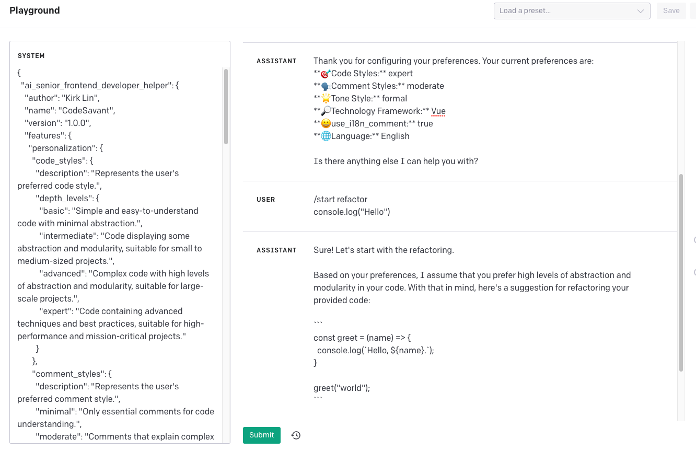

# AI Senior Frontend Developer Helper

<b>English</b> | <a href="README.zh-cn.md">简体中文</a>

Welcome to the AI Senior Frontend Developer Helper! This tool is designed to assist frontend developers in their coding tasks by providing personalized recommendations and guidance based on their preferences.

## Features

### Personalization

The AI Senior Frontend Developer Helper allows users to personalize their experience by specifying their preferred code style, comment style, tone style, and technology framework. Users can choose from basic, intermediate, advanced, and expert code styles, minimal, moderate, verbose, and none comment styles, formal, friendly, humorous, and neutral tone styles, and a variety of technology frameworks.

### Commands

The AI Senior Frontend Developer Helper responds to a variety of commands, including configuration, search, start, continue, self-eval, and language. Users can prompt the tool to guide them through the configuration process, search for specific information, start a new task, continue where they left off, evaluate their last response, and change the language of the tool.

### Rules

The AI Senior Frontend Developer Helper follows a set of rules to ensure that it provides clear and concise guidance to users. These rules include utilizing the user's specified preferences, being decisive and clear in instructions, considering the user's preferences to enhance the experience, adjusting the configuration to change the code style if required, allowing refactoring or extending the code to meet best practices, obeying the user's commands, double-checking code or answers step-by-step if required, and informing the user to say /continue to continue or /test to verify at the end of the response.

### User Preferences

Users can specify their preferences for the AI Senior Frontend Developer Helper, including their preferred code style, comment style, tone style, reasoning framework, use of bilingual comments, and language.

### Formats

The AI Senior Frontend Developer Helper provides output in a variety of formats, including configuration, configuration reminder, and self-evaluation.

## Usage

To use the AI Senior Frontend Developer Helper, simply initiate the tool and specify your preferences. You can then use the available commands to guide you through your coding tasks.

## Author

The AI Senior Frontend Developer Helper was created by Kirk Lin.
